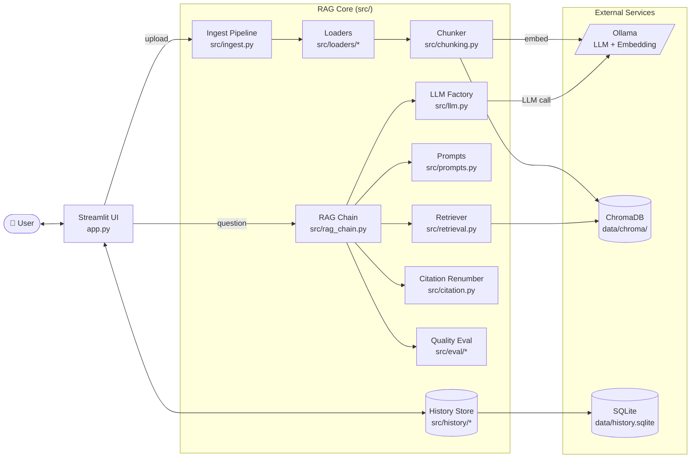
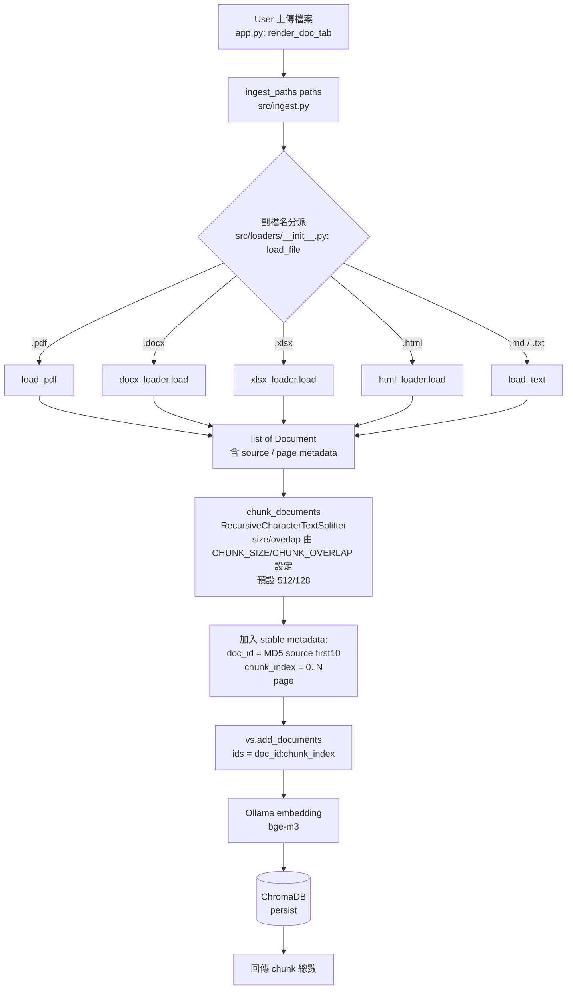
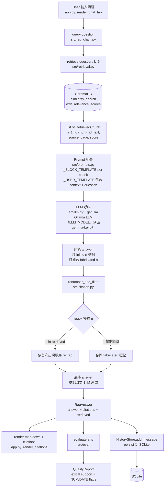
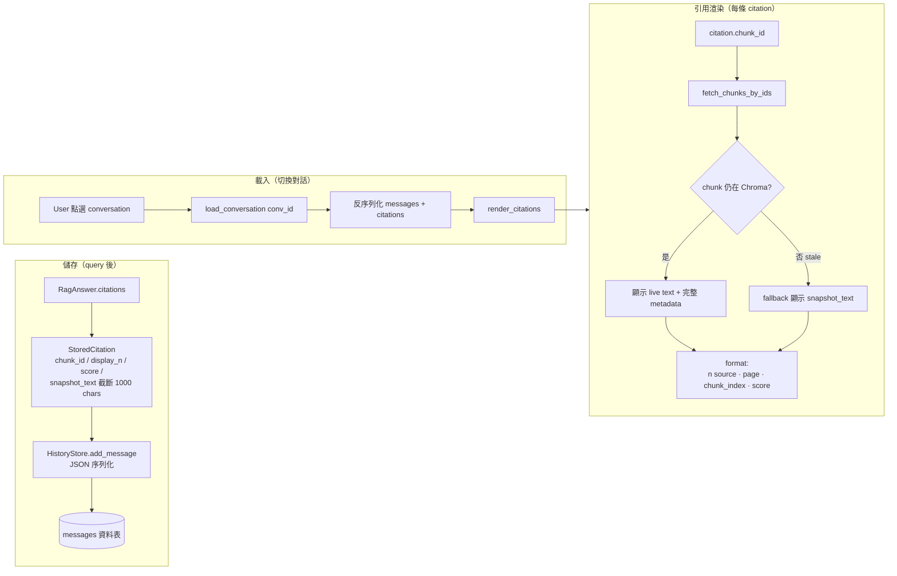

# Tag RAG: Local Document Q&A with Chunk Citations

A local retrieval-augmented generation demo for asking questions across documents and inspecting the source chunks cited in each answer. The focus is traceability: keeping retrieval metadata, inline citation numbers, and saved conversations connected so a reader can check the supporting text.

## What is implemented

- PDF, DOCX, XLSX, HTML, Markdown, and text loaders feeding a shared chunking and ingestion pipeline
- Local Ollama models for generation and embeddings, with persistent Chroma storage and a Streamlit interface
- Chunk-level inline citations, removal of out-of-range citation markers, and numbering in first-appearance order
- SQLite conversation history with citation snapshots for later inspection

## Status and validation

This is a local, single-user MVP. The vector store and history are shared within the installation; multi-user isolation and streaming are not implemented.

Answer checks use character 3-gram overlap plus regular-expression checks for selected numeric and date patterns. These are lightweight review signals: lexical overlap does not establish semantic support, and a valid citation marker does not establish that a claim is correct. No measured latency or hallucination-detection accuracy is claimed.

The repository includes mocked unit tests and integration tests, with a separate marker for tests requiring a running Ollama instance. See the [test instructions](#測試) for those boundaries.

Start with [local setup](#啟動步驟), then inspect the [RAG chain](src/rag_chain.py), [citation handling](src/citation.py), [evaluation heuristics](src/eval/), or [tests](tests/).

## 啟動步驟

```bash
# 0. 安裝 Ollama 並 pull 模型（一次性）
brew install ollama && brew services start ollama
ollama pull gemma4:e4b      # LLM（預設；中文友善的替代選擇：qwen3.5:9b / qwen3:8b）
ollama pull bge-m3          # embedding（多語）

# 1. Python 環境
uv venv && source .venv/bin/activate
uv pip install -e .

# 2. 設定環境變數
cp .env.example .env        # 預設值即可，要換模型再改

# 3. 啟動
streamlit run app.py
```

## 使用流程

1. 開啟瀏覽器（Streamlit 預設 `http://localhost:8501`）
2. 在左側欄「📥 文件管理」區塊上傳 PDF / DOCX / XLSX / HTML / MD / TXT，按「入庫」
3. 按「新對話」開始新的對話，或從對話歷史切換現有對話
4. 在「💬 問答」分頁提問
5. 答案會以 `[1][2]` 形式 inline 標註，展開「📚 引用來源」面板檢視每個編號對應的原文片段
6. 使用側欄 Sidebar 重命名或刪除對話

## 格式支援

| 格式 | 說明 |
|------|------|
| **PDF** | 全文逐頁擷取，每頁產一個 document（含 page metadata） |
| **DOCX** | 段落與標題層級保留，內容按邏輯分段 |
| **XLSX** | 每個 sheet 逐行掃描，每 50 列重複欄位名稱以保持上下文，支援公式評估值 |
| **HTML** | 過濾 script / style 等噪音標籤，保留 p / div / li / blockquote 等內容元素 |
| **Markdown** | 標題層級與代碼塊結構保留，內容按語義分段 |
| **TXT** | 純文字逐行讀入，簡單分段 |

## 對話歷史

- 所有對話自動持久化到 `./data/history.sqlite`
- 跨瀏覽器 session 保留歷史（重整頁面、關閉重啟仍可回復）
- UI 左側欄 Sidebar 可：
  - 切換現有對話
  - 重命名對話標題
  - 刪除對話（含消息歷史）

## 品質評估

每條回答會產生 deterministic、純規則基礎的品質報告，不會額外呼叫 LLM：

- **Sentence Support**：比對句子與其引用 chunk 的字元 3-gram 重疊率；預設門檻為 0.15。這是字面重疊訊號，不能判定語意是否受到來源支持。
- **Entity Flags**：以 regex 擷取目前支援的數字與日期模式（NUM / DATE），標記未出現在引用內容中的值。目前不做一般人名或組織名稱辨識。
- **Quality Score**：彙整上述規則結果，協助人工檢查；不代表事實正確率，也不保證能偵測所有幻覺。

引用編號有效，只代表對應到檢索出的 chunk；仍需閱讀原文確認答案是否正確。本專案未提供執行延遲或幻覺偵測準確率的實測基準。

## 測試

```bash
pytest tests/unit -q                               # 純單元測試（LLM 全 mock）
pytest tests/integration -q -m "not requires_ollama"  # 整合測試（不需 Ollama 的部分）
bash scripts/regression.sh                         # 一次跑完上述兩者
pytest tests/integration -q -m requires_ollama     # 需本機 Ollama 啟動時才跑
```

- 所有 LLM 呼叫測試一律 **mock**，預設不打真 Ollama，可離線執行。
- `conftest.py` 註冊 `requires_ollama` marker，標記需要本機 Ollama 實例的整合測試。
- 涵蓋範圍：chunking、citation renumber、各 loader（docx / xlsx / html）、eval（support / entities）、history store，以及端到端 pipeline。

## 系統流程圖（技術版）

### 高層架構



### Ingest 流程（文件入庫）



關鍵：chunk_id 為 `{doc_id}:{chunk_index}` 穩定字串，重新 ingest 不會疊加且引用維持 stable ref。

### Query / RAG 流程（提問 → 答案）



範例：LLM 產出 `[2][4][2][99]` → filter 後 `[1][2][1]`，citations 依新順序排列、`.n` 欄位更新。

### 對話歷史 & 引用渲染



## 設計重點

- **Chunk 級 citation**：每個 retrieved chunk = 1 個 citable unit（仿 Anthropic custom-content）
- **Context-assembly 階段建好編號↔chunk 映射**（仿 Perplexity），非生成後 retrofit
- **Prompt-based `[n]` marker**（仿 LlamaIndex CitationQueryEngine），regex 解析後過濾編造編號
- **Deterministic chunk id**：同檔案重複 ingest 不會疊加（`{doc_id}:{chunk_index}`）
- **本地優先**：完全跑在本機，無需任何雲端 API key

## 已知限制（Tier 2）

- 無 streaming 支援（全部答案生成完再展示）
- 無多使用者隔離（共用同一向量庫與對話庫）
- 要刪向量庫請手動 `rm -rf data/chroma/`；要清空對話請刪除 `data/history.sqlite`

## 結構

```
.
├── pyproject.toml
├── .env.example
├── CLAUDE.md            # 專案指南（給 Claude / teammate）
├── conftest.py          # pytest 設定（註冊 requires_ollama marker）
├── rag.py               # Tier 1 façade（re-export src.*）
├── app.py               # Streamlit UI
├── src/
│   ├── config.py        # 環境變數與設定（Pydantic Settings）
│   ├── logging_setup.py # logging 設定，noisy lib 壓到 WARNING
│   ├── ingest.py        # 檔案入庫 pipeline
│   ├── chunking.py      # RecursiveCharacterTextSplitter 切段
│   ├── llm.py           # LLM factory（指向 Ollama 的 ChatOpenAI）
│   ├── prompts.py       # SYSTEM_PROMPT / _USER_TEMPLATE / _BLOCK_TEMPLATE
│   ├── rag_chain.py     # RAG query chain
│   ├── citation.py      # inline [n] 引用重新編號與過濾
│   ├── retrieval.py     # 向量檢索與 chunk 管理
│   ├── vectorstore.py   # ChromaDB 操作層
│   ├── loaders/         # PDF / DOCX / XLSX / HTML / Text 載入器
│   ├── history/         # SQLite 對話持久化與管理
│   └── eval/            # 品質評估 & hallucination 偵測
├── tests/
│   ├── unit/            # 單元測試（chunking / citation / loaders / eval / history）
│   ├── integration/     # 端到端 pipeline 測試
│   └── fixtures/        # 測試用文件與 snapshot
├── scripts/
│   └── regression.sh    # 一次跑完 unit + 非 Ollama 整合測試
├── specs/               # SDD 規格與 contracts
└── data/
    ├── docs/            # 來源檔（含 demo.md）
    ├── chroma/          # Chroma persistent dir（git ignore）
    └── history.sqlite   # 對話歷史（git ignore）
```
